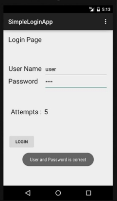

Bài kiểm tra học phần: **Lập trình thiết bị động** 

Lớp: LTTBDD – 2020 

Thời gian: 120 phút, ngày 02/11/2020 

*Nộp bài: Qua hệ thống E-Learning NTU. Nén các Project vào 1 thư mục có tên MSSV *

Câu 1. Sinh viên tạo dự án BaiKT1, đặt tên packet dạng HoVaTen.BaiKT1 (\*bắt buộc),  và thực hiện các yêu cầu sau: 

1. Thiết kế layout như hình **1** 
1. Xử lý khi click lên nút login như sau:  

\- Nếu user name là maicuongtho và password là Cntt60ntu! thì Toast thông báo 

“User and Password is correct”, ngược lại thông báo  “User and Password is wrong” 

Câu 2. Sinh viên tạo dự án BaiKT2, đặt tên packet dạng HoVaTen.BaiKT2 (\*bắt buộc),  và thực hiện các yêu cầu: 

1. Thiết kế layout như hình **2** 
1. Tính tiền tip và Toast thông báo  

*Hình  1. Layout câu 1  Hình 2. Layout câu 2 *

Câu 3. Sinh viên tạo dự án BaiKT3, đặt tên packet dạng HoVaTen.BaiKT3 (\*bắt buộc),  và thực hiện các yêu cầu:  

1. Thiết kế layout như hình **3** 
1. Thực hiện xử lý như sau:  

User click lên mục nào thì hiện chỉ số và giá trị lên 2 điều khiển (editText) ở trên. Khi nhấn vào nút Lưu sửa, app cập nhật dữ liệu người lại từ EditText. Khi nhấn vào Lưu thêm, app sẽ thêm mục vào cuối danh sách. Khi nhấn nút Xóa, app sẽ xóa phần tử ở vị trí đã chọn. Chú ý cần cập nhật lại ListView. 

Gợi ý: phương thức *remove(i)* của ArrayList sẽ xóa phần tử thứ *i* khỏi nó            Phương thức *set(i, x)* sẽ cập nhật phần tử ở vị trí *i*, với giá trị *x*

Câu 4. Sinh viên tạo dự án BaiKT4, đặt tên packet dạng HoVaTen.BaiKT4 (\*bắt buộc),  và thực hiện các tạo CustomListview theo hình 4 

*Hình  3. Layout câu 3  Hình  4. Layout câu 4* 
